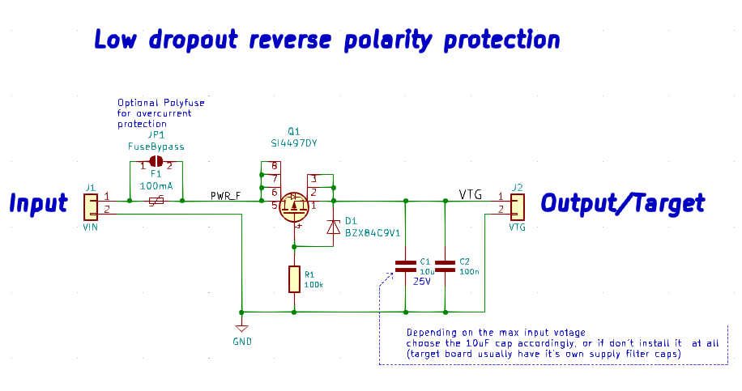

# Reverse-polarity-protection
Simple P-MOS based low dropout reverse polarity protection

  
1. Max input voltage depends on the used P-MOS transitor and the voltage rating of the 10uF cap.
2. Output supply capacitors are optional.
3. If the polyfuse is not used, put a blob of solder on the jumper pads to bypass it.  

### Files:
1. KiCad 5 project.
2. Scheamtic as PDF
3. html BOM file.

___
(c) 2020 by Piotr Zapart
www.hexefx.com
